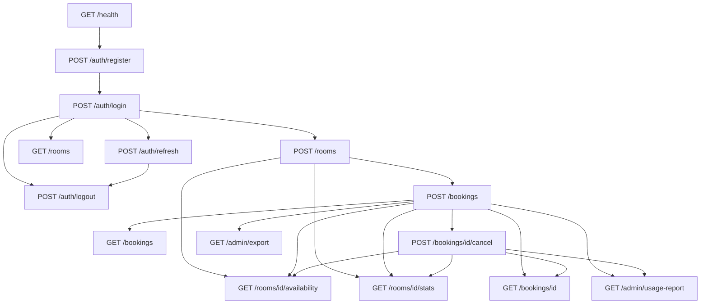

Here is a full route map for E2E workflow testing, derived from `docs/problem_statement.md` Sections 4–5 and the router docs.

---

## Route inventory (15 endpoints)

| #   | Method | Path                       | Auth | Role           | Returns / needs                                         |
| --- | ------ | -------------------------- | ---- | -------------- | ------------------------------------------------------- |
| 1   | GET    | `/health`                  | No   | —              | Liveness                                                |
| 2   | POST   | `/auth/register`           | No   | —              | `{user_id, org_id, username, role}` — no token          |
| 3   | POST   | `/auth/login`              | No   | —              | `{access_token, refresh_token}`                         |
| 4   | POST   | `/auth/refresh`            | No   | —              | Body: `{refresh_token}` → new token pair                |
| 5   | POST   | `/auth/logout`             | Yes  | any            | Invalidates **access** token only                       |
| 6   | GET    | `/rooms`                   | Yes  | any            | List org rooms                                          |
| 7   | POST   | `/rooms`                   | Yes  | **admin**      | Body: `{name, capacity, hourly_rate_cents}` → `room_id` |
| 8   | GET    | `/rooms/{id}/availability` | Yes  | any            | Query: `date=YYYY-MM-DD`                                |
| 9   | GET    | `/rooms/{id}/stats`        | Yes  | any            | Live count + revenue                                    |
| 10  | POST   | `/bookings`                | Yes  | any            | Body: `{room_id, start_time, end_time}` → `booking_id`  |
| 11  | GET    | `/bookings`                | Yes  | any            | Query: `page`, `limit` — **own bookings only**          |
| 12  | GET    | `/bookings/{id}`           | Yes  | any            | Member: own only; Admin: any in org                     |
| 13  | POST   | `/bookings/{id}/cancel`    | Yes  | owner or admin | Refund response                                         |
| 14  | GET    | `/admin/usage-report`      | Yes  | **admin**      | Query: `from`, `to`                                     |
| 15  | GET    | `/admin/export`            | Yes  | **admin**      | Query: `room_id?`, `include_all?`                       |

---

## Prerequisite chain (what each route needs from a prior step)



**Hard dependencies:**

- Any authenticated route → need `access_token` from **login** or **refresh**
- `POST /rooms`, `/admin/*` → need **admin** role
- `/rooms/{id}/*`, `POST /bookings` → need `room_id` from `POST /rooms` or `GET /rooms`
- `/bookings/{id}/*` → need `booking_id` from `POST /bookings` or `GET /bookings`
- `/admin/usage-report` → need `from` + `to` dates
- `/rooms/{id}/availability` → need `date`

---

## Valid route → route transitions (all 210 pairs, classified)

### From public routes (no token)

| From                  | Valid next routes                                                                                                              |
| --------------------- | ------------------------------------------------------------------------------------------------------------------------------ |
| `GET /health`         | **All 14 others** (independent sanity check)                                                                                   |
| `POST /auth/register` | `GET /health`, `POST /auth/register`, `POST /auth/login`                                                                       |
| `POST /auth/login`    | **All 12 authenticated routes** (role-gated) + `GET /health`, `POST /auth/register`, `POST /auth/refresh`, `POST /auth/logout` |
| `POST /auth/refresh`  | Same as login (you get a fresh access token)                                                                                   |

### From authenticated routes (any logged-in user)

| From                           | Valid next routes                                                                                                                                                                           |
| ------------------------------ | ------------------------------------------------------------------------------------------------------------------------------------------------------------------------------------------- |
| `POST /auth/logout`            | `GET /health`, `POST /auth/register`, `POST /auth/login`, `POST /auth/refresh` (refresh still valid per Rule 8), then re-auth for protected routes                                          |
| `GET /rooms`                   | `GET /rooms/{id}/availability`, `GET /rooms/{id}/stats`, `POST /bookings`, `GET /bookings`, `POST /auth/logout`, `POST /auth/refresh`, all other auth routes                                |
| `GET /rooms/{id}/availability` | `GET /rooms/{id}/stats`, `POST /bookings`, `GET /bookings`, `GET /bookings/{id}`, `POST /bookings/{id}/cancel`, `GET /rooms`, `POST /auth/logout`                                           |
| `GET /rooms/{id}/stats`        | Same as availability                                                                                                                                                                        |
| `POST /bookings`               | `GET /bookings`, `GET /bookings/{id}`, `POST /bookings/{id}/cancel`, `GET /rooms/{id}/availability`, `GET /rooms/{id}/stats`, `POST /bookings` (another), `GET /rooms`, `POST /auth/logout` |
| `GET /bookings`                | `GET /bookings/{id}`, `POST /bookings/{id}/cancel`, `GET /bookings?page=2` (pagination), `POST /bookings`, all room routes                                                                  |
| `GET /bookings/{id}`           | `POST /bookings/{id}/cancel`, `GET /bookings`, `GET /rooms/{id}/stats`, `GET /rooms/{id}/availability`                                                                                      |
| `POST /bookings/{id}/cancel`   | `GET /bookings/{id}` (verify refunds), `GET /rooms/{id}/availability`, `GET /rooms/{id}/stats`, `GET /bookings`, `POST /bookings` (rebook slot), `POST /bookings/{id}/cancel` (expect 409)  |

### Admin-only additions

| From                         | Extra valid next (admin only)                                                                                                                      |
| ---------------------------- | -------------------------------------------------------------------------------------------------------------------------------------------------- |
| `POST /auth/login` (admin)   | `POST /rooms`, `GET /admin/usage-report`, `GET /admin/export`                                                                                      |
| `POST /rooms`                | `GET /rooms`, `GET /rooms/{id}/availability`, `GET /rooms/{id}/stats`, `POST /bookings`, `GET /admin/usage-report`, `GET /admin/export`            |
| `POST /bookings`             | `GET /admin/usage-report`, `GET /admin/export`                                                                                                     |
| `POST /bookings/{id}/cancel` | `GET /admin/usage-report`, `GET /admin/export`                                                                                                     |
| `GET /admin/usage-report`    | `GET /admin/export`, `POST /bookings`, `POST /bookings/{id}/cancel`, `GET /rooms/{id}/stats`, `GET /rooms/{id}/availability`, `GET /bookings/{id}` |
| `GET /admin/export`          | Same as usage-report                                                                                                                               |

### Invalid / blocked transitions (test as negative paths)

| From                                             | To                                        | Why                                  |
| ------------------------------------------------ | ----------------------------------------- | ------------------------------------ |
| `POST /auth/register`                            | any auth route                            | Register does **not** return a token |
| `POST /auth/logout`                              | any auth route (old token)                | Access token blacklisted → 401       |
| `POST /auth/refresh` (old refresh)               | `POST /auth/refresh`                      | Reuse → 401 (Rule 8)                 |
| Member token                                     | `POST /rooms`                             | 403 `FORBIDDEN`                      |
| Member token                                     | `GET /admin/*`                            | 403 `FORBIDDEN`                      |
| Member token                                     | `GET /bookings/{other_member_id}`         | 404 `BOOKING_NOT_FOUND` (Rule 10)    |
| Member token                                     | `POST /bookings/{other_member_id}/cancel` | 404 `BOOKING_NOT_FOUND`              |
| Any user                                         | cross-org `room_id` / `booking_id`        | 404 (Rule 9)                         |
| `POST /bookings/{id}/cancel` (already cancelled) | `POST /bookings/{id}/cancel`              | 409 `ALREADY_CANCELLED`              |

---

## Complete E2E workflow paths (every meaningful scenario)

Below, `→` means "call in order, carry IDs/tokens forward."

### Tier 0 — Bootstrap (no prior state)

| ID  | Path                                                                                                       | Rules tested                      |
| --- | ---------------------------------------------------------------------------------------------------------- | --------------------------------- |
| W0  | `GET /health`                                                                                              | 16                                |
| W1  | `POST /auth/register` (new org) → `POST /auth/login`                                                       | 15                                |
| W2  | `POST /auth/register` (admin, org A) → `POST /auth/register` (member, org A) → `POST /auth/login` (member) | 15                                |
| W3  | `POST /auth/register` (org A) → `POST /auth/register` (same username, org A)                               | 15 → expect 409                   |
| W4  | `POST /auth/register` (org A, user X) → `POST /auth/register` (org B, user X)                              | 15 → same username OK across orgs |

### Tier 1 — Auth token lifecycle

| ID  | Path                                                                           | Rules tested            |
| --- | ------------------------------------------------------------------------------ | ----------------------- |
| A1  | `POST /auth/login` → `POST /auth/refresh` → `POST /auth/logout`                | 8                       |
| A2  | `POST /auth/login` → `POST /auth/refresh` → `POST /auth/refresh` (old refresh) | 8 → expect 401          |
| A3  | `POST /auth/login` → `POST /auth/logout` → `GET /rooms` (old access)           | 8 → expect 401          |
| A4  | `POST /auth/login` → `POST /auth/logout` → `POST /auth/refresh`                | 8 → refresh still works |
| A5  | `POST /auth/login` → `POST /auth/refresh` → `GET /rooms` (new access)          | 8                       |
| A6  | `POST /auth/login` (bad creds)                                                 | contract → 401          |

### Tier 2 — Admin org setup

| ID  | Path                                                      | Rules tested |
| --- | --------------------------------------------------------- | ------------ |
| S1  | `register` → `login` → `POST /rooms` → `GET /rooms`       | contract     |
| S2  | S1 → `GET /rooms/{id}/availability?date=...` (empty busy) | 13           |
| S3  | S1 → `GET /rooms/{id}/stats` (zeros)                      | 14           |
| S4  | `register` → `login` (member) → `POST /rooms`             | 403          |

### Tier 3 — Booking lifecycle (single user)

| ID  | Path                                                                                                                            | Rules tested    |
| --- | ------------------------------------------------------------------------------------------------------------------------------- | --------------- |
| B1  | **Golden path** (extends `test_smoke.py`): `health` → `register` → `login` → `POST /rooms` → `POST /bookings` → `GET /bookings` | smoke           |
| B2  | B1 → `GET /bookings/{id}`                                                                                                       | 10              |
| B3  | B2 → `POST /bookings/{id}/cancel` → `GET /bookings/{id}` (refunds[])                                                            | 6, 10           |
| B4  | B1 → `GET /rooms/{id}/availability` (shows busy) → `POST /bookings/{id}/cancel` → `GET /rooms/{id}/availability` (slot free)    | 13              |
| B5  | B1 → `GET /rooms/{id}/stats` → cancel → `GET /rooms/{id}/stats`                                                                 | 14              |
| B6  | `availability` → `POST /bookings` → `availability` (verify interval)                                                            | 13              |
| B7  | `POST /bookings` → `POST /bookings` (overlapping slot)                                                                          | 3 → 409         |
| B8  | `POST /bookings` → `POST /bookings` (back-to-back)                                                                              | 3 → 201         |
| B9  | Create 4 bookings in (now, now+24h] → 4th fails                                                                                 | 4 → 409         |
| B10 | `POST /bookings` × 21 rapidly                                                                                                   | 5 → 429 on 21st |

### Tier 4 — Admin reporting loop

| ID  | Path                                                                          | Rules tested      |
| --- | ----------------------------------------------------------------------------- | ----------------- |
| R1  | setup (admin+room) → `POST /bookings` → `GET /admin/usage-report?from&to`     | 12                |
| R2  | R1 → `GET /admin/export`                                                      | contract          |
| R3  | R1 → cancel → `GET /admin/usage-report` (excludes cancelled)                  | 12                |
| R4  | R1 → `GET /admin/export?room_id=X`                                            | contract          |
| R5  | R1 → `GET /admin/export?include_all=true`                                     | contract + Rule 9 |
| R6  | `usage-report` → `POST /bookings` → `usage-report` (must reflect immediately) | 12                |
| R7  | `stats` → `POST /bookings` → `stats` → cancel → `stats`                       | 14                |

### Tier 5 — Multi-actor (admin + member)

| ID  | Path                                                                                                           | Rules tested |
| --- | -------------------------------------------------------------------------------------------------------------- | ------------ |
| M1  | admin: `register`→`login`→`POST /rooms` → member: `register`→`login` → member: `GET /rooms` → `POST /bookings` | 15, contract |
| M2  | M1 → member: `GET /bookings` → admin: `GET /bookings/{member_booking_id}`                                      | 10           |
| M3  | M2 → admin: `POST /bookings/{id}/cancel`                                                                       | 6, 10        |
| M4  | M2 → member2: `GET /bookings/{member1_booking_id}`                                                             | 10 → 404     |
| M5  | M2 → member2: `POST /bookings/{id}/cancel`                                                                     | 10 → 404     |
| M6  | M1 → member: cancel own booking                                                                                | 6            |
| M7  | admin books for self → member reads admin booking (member can't)                                               | 10           |

### Tier 6 — Multi-tenancy isolation

| ID  | Path                                                                            | Rules tested |
| --- | ------------------------------------------------------------------------------- | ------------ |
| T1  | orgA admin creates room+booking → orgB admin: `GET /bookings/{orgA_booking_id}` | 9 → 404      |
| T2  | orgB: `POST /bookings` with orgA `room_id`                                      | 9 → 404      |
| T3  | orgB: `GET /rooms/{orgA_room_id}/availability`                                  | 9 → 404      |
| T4  | orgB: `GET /rooms/{orgA_room_id}/stats`                                         | 9 → 404      |
| T5  | orgA admin: `GET /admin/export?include_all=true&room_id={orgB_room}`            | 9            |
| T6  | orgA admin: `GET /admin/usage-report` (only orgA rooms)                         | 9            |

### Tier 7 — Pagination workflow

| ID  | Path                                                                                   | Rules tested |
| --- | -------------------------------------------------------------------------------------- | ------------ |
| P1  | create 15 bookings → `GET /bookings?page=1&limit=10` → `GET /bookings?page=2&limit=10` | 11           |
| P2  | P1 → verify no skip/repeat, ascending `start_time`, `total` correct                    | 11           |

### Tier 8 — Refund tier workflows (time-sensitive)

| ID  | Path                                                       | Rules tested |
| --- | ---------------------------------------------------------- | ------------ |
| C1  | book start +72h → cancel → 100% refund                     | 6            |
| C2  | book start +36h → cancel → 50% refund                      | 6            |
| C3  | book start +12h → cancel → 0% refund                       | 6            |
| C4  | cancel → `POST /bookings/{id}/cancel` again                | 6 → 409      |
| C5  | cancel → `GET /bookings/{id}` → refund amount == RefundLog | 6            |

### Tier 9 — Datetime / validation workflows

| ID  | Path                                                                           | Rules tested |
| --- | ------------------------------------------------------------------------------ | ------------ |
| D1  | `POST /bookings` with offset datetime → `GET /bookings/{id}` (UTC in response) | 1            |
| D2  | `POST /bookings` past start → 400                                              | 2            |
| D3  | `POST /bookings` 9-hour duration → 400                                         | 2            |
| D4  | `POST /bookings` non-whole hours → 400                                         | 2            |

---

## Master adjacency list (route → every valid immediate successor)

Use this as the building block for chaining arbitrary-length E2E tests:

```
GET /health
  → ALL

POST /auth/register
  → GET /health
  → POST /auth/register
  → POST /auth/login

POST /auth/login
  → GET /health
  → POST /auth/register
  → POST /auth/refresh
  → POST /auth/logout
  → GET /rooms
  → POST /rooms                    [admin only]
  → GET /rooms/{id}/availability   [needs room_id]
  → GET /rooms/{id}/stats          [needs room_id]
  → POST /bookings                 [needs room_id]
  → GET /bookings
  → GET /bookings/{id}             [needs booking_id]
  → POST /bookings/{id}/cancel     [needs booking_id]
  → GET /admin/usage-report        [admin only]
  → GET /admin/export              [admin only]

POST /auth/refresh
  → (same as POST /auth/login)

POST /auth/logout
  → GET /health
  → POST /auth/register
  → POST /auth/login
  → POST /auth/refresh
  → (any auth route with NEW token from login/refresh)

GET /rooms
  → POST /rooms                    [admin]
  → GET /rooms/{id}/availability
  → GET /rooms/{id}/stats
  → POST /bookings
  → GET /bookings
  → GET /bookings/{id}
  → POST /bookings/{id}/cancel
  → GET /admin/usage-report        [admin]
  → GET /admin/export              [admin]
  → POST /auth/logout
  → POST /auth/refresh

POST /rooms
  → GET /rooms
  → GET /rooms/{id}/availability
  → GET /rooms/{id}/stats
  → POST /bookings
  → GET /admin/usage-report
  → GET /admin/export
  → POST /auth/logout

GET /rooms/{id}/availability
  → GET /rooms/{id}/stats
  → POST /bookings
  → GET /bookings
  → GET /bookings/{id}
  → POST /bookings/{id}/cancel
  → GET /rooms
  → GET /admin/usage-report        [admin]
  → GET /admin/export              [admin]

GET /rooms/{id}/stats
  → (same as availability)

POST /bookings
  → GET /bookings
  → GET /bookings/{id}
  → POST /bookings/{id}/cancel
  → GET /rooms/{id}/availability
  → GET /rooms/{id}/stats
  → POST /bookings
  → GET /admin/usage-report        [admin]
  → GET /admin/export              [admin]
  → GET /rooms

GET /bookings
  → GET /bookings?page=N&limit=M
  → GET /bookings/{id}
  → POST /bookings/{id}/cancel
  → POST /bookings
  → GET /rooms/{id}/availability
  → GET /rooms/{id}/stats

GET /bookings/{id}
  → POST /bookings/{id}/cancel
  → GET /bookings
  → GET /rooms/{id}/availability
  → GET /rooms/{id}/stats
  → GET /admin/usage-report        [admin]
  → GET /admin/export              [admin]

POST /bookings/{id}/cancel
  → GET /bookings/{id}
  → GET /rooms/{id}/availability
  → GET /rooms/{id}/stats
  → GET /bookings
  → POST /bookings
  → GET /admin/usage-report        [admin]
  → GET /admin/export              [admin]
  → POST /bookings/{id}/cancel     [expect 409]

GET /admin/usage-report
  → GET /admin/export
  → POST /bookings
  → POST /bookings/{id}/cancel
  → GET /rooms/{id}/stats
  → GET /rooms/{id}/availability
  → GET /bookings/{id}
  → GET /bookings

GET /admin/export
  → GET /admin/usage-report
  → (same follow-ups as usage-report)
```

---

## Recommended minimum E2E suite (covers all 16 business rules)

If you want a practical starting set before enumerating every combination:

| Priority | Workflow              | Path                   |
| -------- | --------------------- | ---------------------- |
| P0       | Smoke                 | W0 → W1 → S1 → B1      |
| P1       | Full booking loop     | B1 → B2 → B3 → B4 → B5 |
| P2       | Auth                  | A1, A2, A3             |
| P3       | Multi-actor           | M1 → M2 → M3           |
| P4       | Reporting consistency | R6, R7                 |
| P5       | Isolation             | T1, T2, T5             |
| P6       | Quota/conflict/rate   | B8, B9, B10            |
| P7       | Refunds               | C1, C2, C3, C5         |
| P8       | Pagination            | P1, P2                 |

Your existing `tests/test_smoke.py` only covers **W0 + partial B1** (6 of 15 routes). The gap is everything after `GET /bookings`: no `GET /bookings/{id}`, cancel, availability, stats, usage-report, export, refresh, or logout.

---

## How to structure the test file

Suggested pattern using your existing `conftest.py` helpers (`new_admin`, `new_member`, `create_room`, `make_booking`):

```python
def test_e2e_full_org_lifecycle(client):
    # W1 + S1 + B1 + B3 + R1 + R2 + A1
    admin = new_admin(client)
    room = create_room(client, admin)
    booking = make_booking(client, admin, room["id"], ...)

    client.get(f"/bookings/{booking.json()['id']}", headers=admin.headers)
    client.post(f"/bookings/{booking.json()['id']}/cancel", headers=admin.headers)
    client.get(f"/rooms/{room['id']}/availability", params={"date": "..."}, headers=admin.headers)
    client.get(f"/rooms/{room['id']}/stats", headers=admin.headers)
    client.get("/admin/usage-report", params={"from": "...", "to": "..."}, headers=admin.headers)
    client.get("/admin/export", headers=admin.headers)

    refresh = client.post("/auth/refresh", json={"refresh_token": admin.refresh_token})
    client.post("/auth/logout", headers=auth_header(refresh.json()["access_token"]))
```

---

If you want, I can next turn this into an actual `tests/test_e2e_workflows.py` file with parameterized paths for each workflow ID (W1, A1, B1, M1, etc.).
